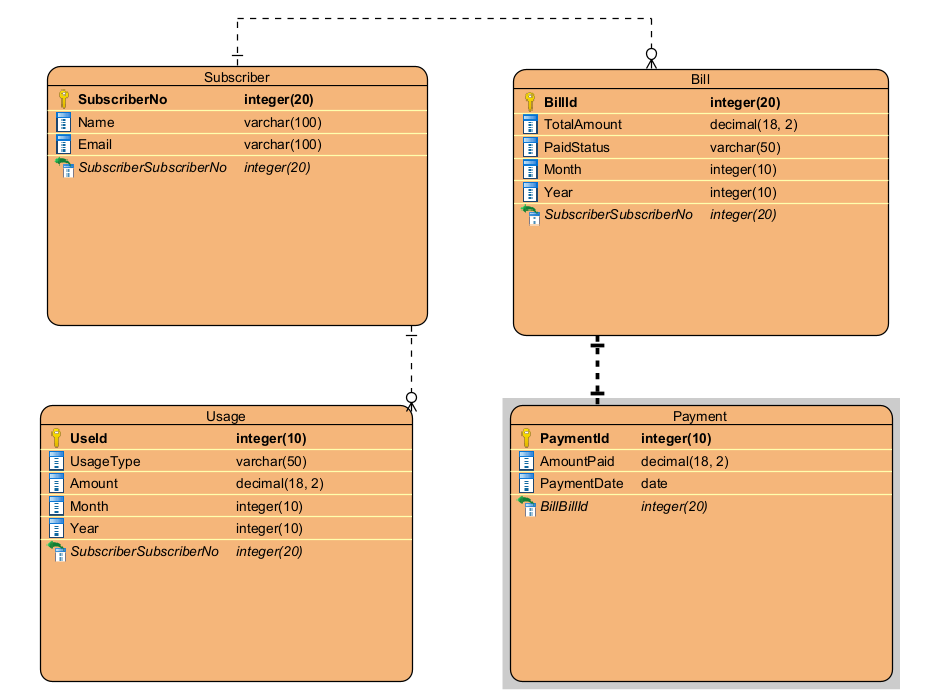

# Mobile Billing System API

This is an API project for a mobile provider billing system. The project is built using ASP.NET Core and is designed to handle billing, payment, usage tracking, and authentication for subscribers.

## Features

1. **Authentication**:
   - JWT-based authentication to log in and protect other endpoints.

2. **Billing**:
   - Calculate and query bills for subscribers.
   - Handle detailed queries and payment status.

3. **Usage**:
   - Add and track usage for subscribers (e.g., phone minutes and internet usage).

4. **Payment**:
   - Handle bill payment and update payment status.

## Technologies Used

- **ASP.NET Core**: For building the API.
- **JWT (JSON Web Token)**: For authentication and authorization.
- **Entity Framework Core**: For database interaction.
- **PostgreSQL**: For database management.
- **Swagger**: For API documentation.

## ER Diagram 



## API Endpoints

### Authentication

#### POST `/api/v1/auth/login`
- **Request Body**: 
  ```json
  {
    "username": "string",
    "password": "string"
  }
  ```
- **Response**: 
  ```json
  {
    "token": "jwt_token_here"
  }
  ```

### Bill

#### POST `/api/v1/bill/CalculateBill`
- **Request Body**: 
  ```json
  {
    "subscriberNo": 123,
    "month": 4,
    "year": 2025
  }
  ```
- **Response**: 
  ```json
  {
    "message": "Total Bill: 75 USD"
  }
  ```

#### GET `/api/v1/bill/QueryBill`
- **Query Parameters**:
  - `subscriberNo`: The subscriber's number.
  - `month`: The month of the bill.
  - `year`: The year of the bill.
- **Response**: 
  ```json
  {
    "message": "Total Bill: 75 USD, Paid Status: Unpaid"
  }
  ```

#### GET `/api/v1/bill/QueryDetailedBill`
- **Query Parameters**:
  - `subscriberNo`: The subscriber's number.
  - `month`: The month of the bill.
  - `year`: The year of the bill.
  - `pageNumber`: The page number for pagination.
  - `pageSize`: The size of each page for pagination.
- **Response**: 
  ```json
  {
    "message": "Phone Usage: 1000 minutes, Phone Charge: 10 USD\nInternet Usage: 15 GB, Internet Charge: 10 USD\nTotal Amount: 75 USD, Paid Status: Unpaid"
  }
  ```

#### POST `/api/v1/bill/PayBill`
- **Request Body**:
  ```json
  {
    "subscriberNo": 123,
    "month": 4,
    "year": 2025
  }
  ```
- **Response**: 
  ```json
  {
    "message": "Payment successful"
  }
  ```

### Usage

#### POST `/api/v1/usage`
- **Request Body**:
  ```json
  {
    "subscriberNo": 123,
    "usageType": "phone",
    "amount": 500,
    "month": 4,
    "year": 2025
  }
  ```
- **Response**: 
  ```json
  {
    "message": "Usage successfully added."
  }
  ```

## Database Model

- **Subscriber**: Represents a subscriber with their personal information.
- **Bill**: Represents the billing details of a subscriber.
- **Usage**: Represents the usage of services by the subscriber, like phone calls and internet usage.
- **Payment**: Represents a payment made for a bill.

## Setup Instructions

1. Clone the repository:
   ```bash
   git clone https://github.com/yourusername/MobileBillingSystem.git
   ```

2. Install the required NuGet packages:
   ```bash
   dotnet restore
   ```

3. Update your database connection string in the `appsettings.json` file.

4. Apply migrations to the PostgreSQL database:
   ```bash
   dotnet ef database update
   ```

5. Run the API:
   ```bash
   dotnet run
   ```

6. Open the Swagger UI at `https://mobilebillingsystem-azdrgpeqbeesc8hd.italynorth-01.azurewebsites.net/index.html` to test the endpoints.
